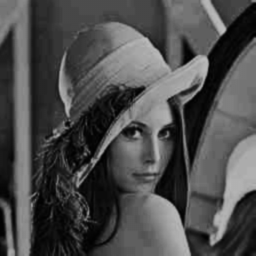
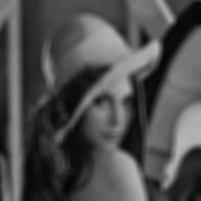
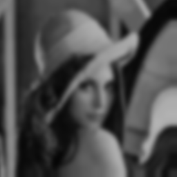
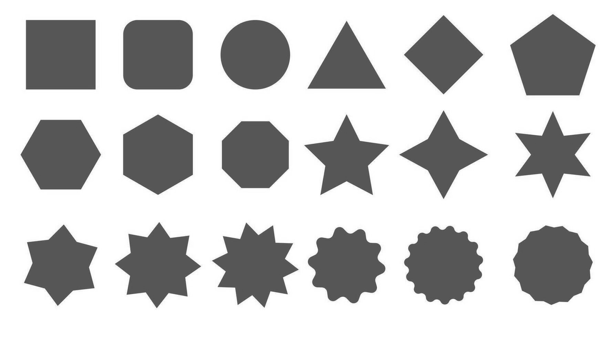
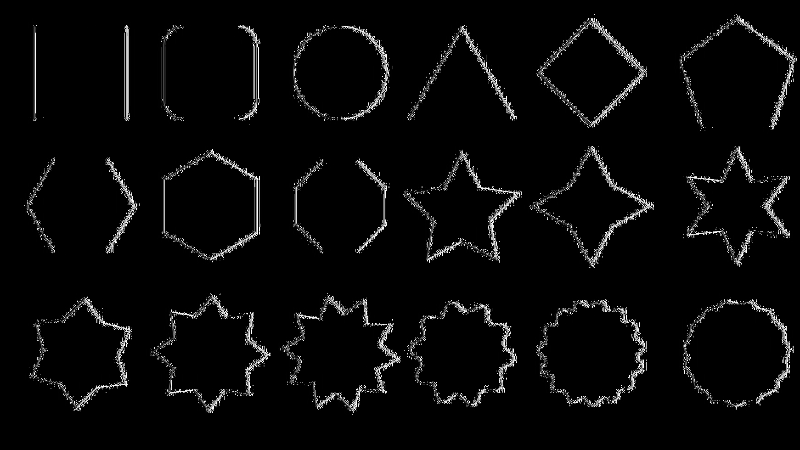
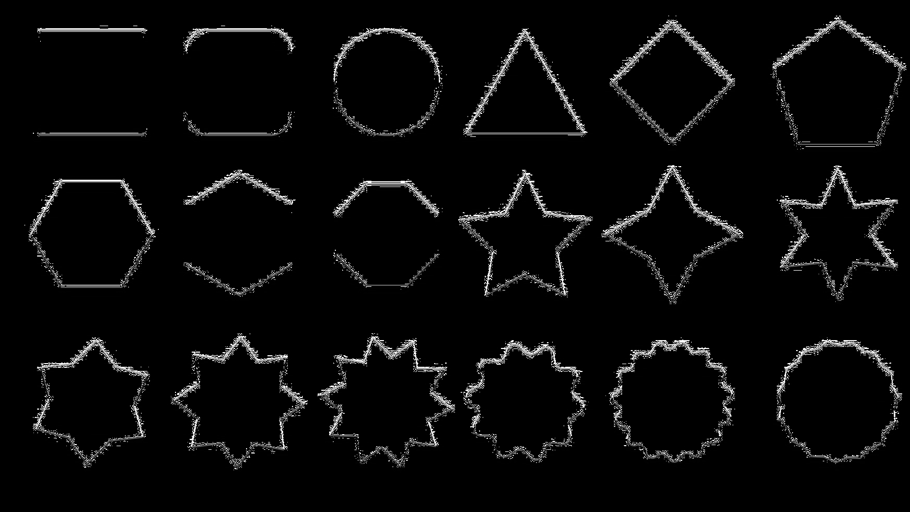
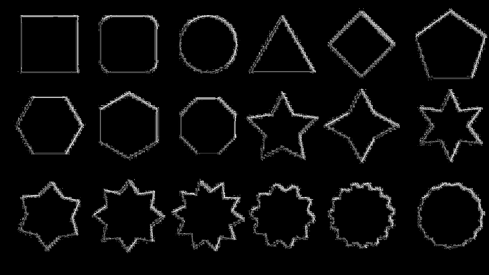
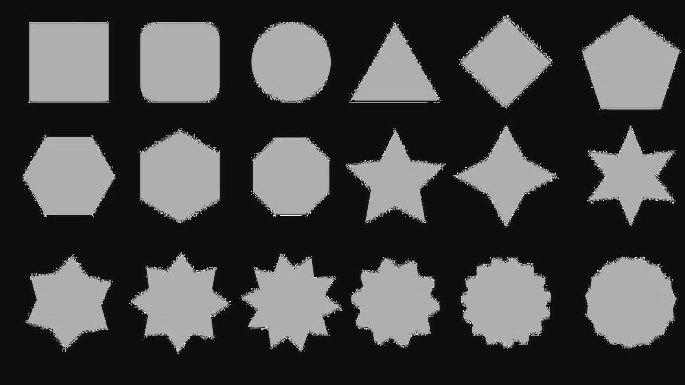
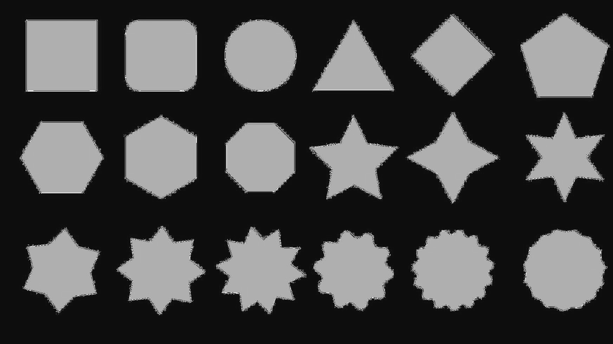
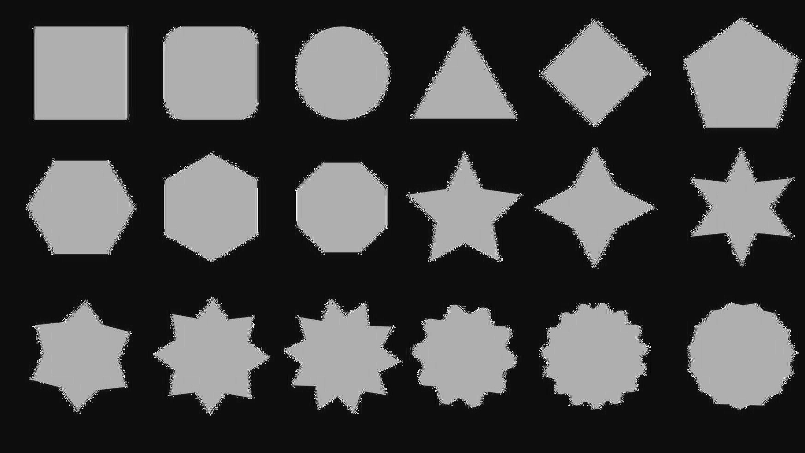

# Linear Filters in Image Processing
Enhancing and extracting image features through classical convolution-based filtering.

*Supports GRAYSCALE images only, and uses clamping not padding in convolution*

---

## Denoising

| Original | Moving average | gaussian |
|----------|----------------|----------|
|  |  |  |

## Blurring

| Original | Moving average | gaussian |
|----------|----------------|----------|
|  |  |  |

## Edge Detection Steerable 
*first partial derivative wrt direction, Gaussian*

| Original | 0 deg | pi/2 deg | pi/4 deg |
|----------|-------|----------|----------|
|  |  |  |  |

## Shape Detection Steerable 
*second partial derivative wrt direction, Gaussian*

| Original | 0 deg | pi/2 deg | pi/4 deg |
|----------|-------|----------|----------|
|  |  |  |  |

---

## Features

- **Gaussian Blur**: Softens images and removes high-frequency noise  
- **moving average**: Simple average blur  
- **Steerable Filters**: Edge/structure detection at arbitrary orientations  
- **Custom Convolution Support**: Plug your own kernel  

---

## How to Use

1. get the data from the image
2. Apply the desired filter, for example :
   ```cpp
   unsigned char* convolve(img, gaussian_kernel, size);
4. enjoy :)


---
## Parameters to Tune

| Parameter     | Description                                             |
|---------------|---------------------------------------------------------|
| Kernel Size   | Size of the filter (e.g. 3×3, 5×5). Affects smoothing   |
| Sigma         | Standard deviation for Gaussian blur. *(3 \* sigma = 1/2 kernal_length)* |
| Angle         | Orientation angle for steerable filters (in degrees)    |

---

*Developed by Mohammed Yasser Mohammed* 

*email : es-mohamed.yasser2027@alexu.edu.eg* 
